# Domarc SMTP Relay — Manuale Utente

> **Versione:** 0.9.3 (Beta) · **Aggiornato:** 2026-05-05
> **Pubblico:** operatori e amministratori che gestiscono regole di smistamento mail, IA, autorizzazioni H24 e configurazioni di servizio.

> **Novità 0.9.3** (Migration 028-036):
> - **Customer sync agnostico** (M028): la tabella clienti è autoritativa, alimentabile da postgres / mssql / csv / json url con mapping configurabile. Non sei più legato a un manager esterno specifico.
> - **Gruppi cliente self-contained** (M034): regole di auto-assegnamento basate sui campi del cliente. I gruppi si compongono da soli.
> - **Rule semplificate** (M035): il filtro contratto/profilo si fa **solo via gruppi cliente**. Più semplice, più chiaro.
> - **Shadow mode in cascata** (M030/M031/M033): testa nuove regole/gruppi/domini in produzione senza eseguire le azioni.
> - **Thread continuation RFC 2822** (M036): le risposte a una mail già tracciata NON aprono un nuovo ticket.
> - **Form regole sincronizzati**: orfana, gruppo padre, figlio hanno gli stessi campi (recipient_groups, fasce orarie, gruppi cliente, shadow, thread, …).

> **Convenzioni UI v0.9.x**:
> - Tabelle: **ordinamento cliccando l'intestazione** (▲/▼) — auto-detection text/numero/data.
> - Form regole: **5 sotto-card** (Origine, Destinazione, Oggetto, Cliente, Orario) con campi mutex grigiati e preset orari da profili.
> - Header: **indicatore globale stato kill switch** (verde "OK" / rosso "KILL ON" pulsante) sempre visibile.
> - Menu: ribilanciato in dropdown logici (Regole&Mail flow, H24&Autorizzazioni, Anagrafiche, Orari, Sistema) + AI Assistant top-level.
> - Codici H24: **panoramica unica** [/codes-h24/](codes_h24_overview.png) con tab Monouso/Permanenti/Mailbox.
> - Aggregazioni errori: **tab Statiche/Semantiche AI** unificate.

Questo manuale descrive **come si usa** la console web Domarc SMTP Relay con linguaggio operativo. Per la documentazione tecnica (schema DB, endpoint API, migrations) c'è il [Manuale tecnico auto-generato](../manual.md) e [`docs/guida_funzionamento.md`](../guida_funzionamento.md).

---

## Indice

1. [Cos'è e cosa fa](#1-cosè-e-cosa-fa)
2. [Accesso e ruoli](#2-accesso-e-ruoli)
3. [Dashboard](#3-dashboard)
4. [Le regole — il cuore del sistema](#4-le-regole--il-cuore-del-sistema)
5. [Anagrafica clienti, gruppi clienti e orari di servizio](#5-anagrafica-clienti-gruppi-clienti-e-orari-di-servizio)
   - 5.1 Customer sync agnostico (Migration 028)
   - 5.2 Gruppi cliente self-contained (Migration 034)
6. [Destinatari & gruppi destinatari (Migration 025/030)](#6-destinatari--gruppi-destinatari-migration-025)
7. [H24 — autorizzazioni interventi fuori orario](#7-h24--autorizzazioni-interventi-fuori-orario)
8. [Cronologia eventi e Activity live](#8-cronologia-eventi-e-activity-live)
9. [Coda e quarantena](#9-coda-e-quarantena)
10. [Intelligenza Artificiale (IA) — integrazione completa](#10-intelligenza-artificiale-ia--integrazione-completa)
11. [Template di risposta](#11-template-di-risposta)
12. [Privacy bypass list](#12-privacy-bypass-list)
13. [Utenti, ruoli e sicurezza](#13-utenti-ruoli-e-sicurezza)
14. [Domande frequenti](#14-domande-frequenti)

---

## 1. Cos'è e cosa fa

Domarc SMTP Relay è il sistema che riceve **tutte le email che arrivano agli indirizzi gestiti** (es. `info@cliente.it`, `monitoring@cliente.it`, `assistenza@datia.it`) e decide cosa farne automaticamente: inoltrarle al destinatario reale, ignorarle, aprire un ticket sul gestionale, mandarle in quarantena o passarle prima all'IA per essere classificate.

Le decisioni le prende un **motore di regole** (Rule Engine v2) deterministico e, dove le regole non bastano, un assistente **IA** (Claude Haiku/Sonnet con routing per job) che opera in modalità *shadow* o *live*. Il tutto è amministrato da questa console web.

### Flusso di una mail (fase per fase)

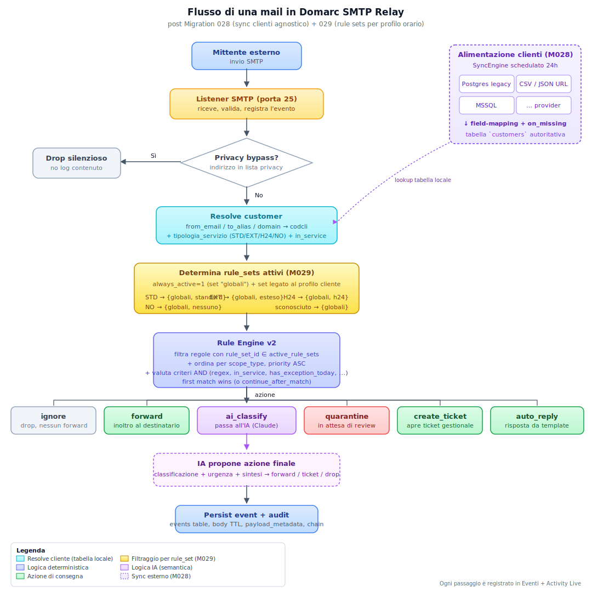

In sintesi:

1. La mail arriva dal mittente esterno al **Listener SMTP** (aiosmtpd, porta 25 o 587).
2. **Privacy bypass check**: se mittente o destinatario sono nella *privacy-bypass list* (vedi §12), la mail viene scartata senza neanche essere registrata nel DB. È pensato per indirizzi GDPR-sensitive (es. medici, legali) per cui è vietato persistere il body.
3. Il **parser** estrae header e body, **decodifica il subject RFC 2047** una sola volta in entrata (così non c'è doppio encoding nei subject delle risposte automatiche), normalizza mittente/destinatari.
4. **Resolve customer** dalla tabella `customers` locale autoritativa (Migration 028, alimentata da feed esterni schedulati 24h via `customer_sync` configurabile dalla UI): da `from_address` / `to_alias` / domain → `codcli` + `contract_active` + `tipologia_servizio` (STD/EXT/H24/NO) + `in_service` (calcolato dal profilo + ora corrente).
5. **Thread continuation check** (Migration 036): se la mail è una risposta a un'email già tracciata (`In-Reply-To` o `References` matchano un `message_id` registrato), il sistema lo riconosce e l'evento eredita il `ticket_id` del parent. La regola seed "Thread continuation" la inoltra al destinatario senza aprire un nuovo ticket.
6. Il **Rule Engine** scorre tutte le regole abilitate in ordine di priorità globale. Trova la **prima** che fa match tra criteri (regex, dominio, **gruppi cliente** [M035 unica chiave per filtrare contratto/profilo], gruppi destinatario, `match_in_service`, `match_has_exception_today`, `match_is_thread_continuation`, ecc.).
7. La regola dice **cosa fare** (`action`):
    - `forward` — inoltra al destinatario reale o a una lista/gruppo
    - `redirect` — riscrive il destinatario
    - `auto_reply` — risponde con template Jinja2 (con o senza codice di autorizzazione)
    - `create_authorized_ticket` — apre ticket dopo validazione codice H24
    - `create_ticket` — apre ticket diretto
    - `quarantine` — sposta in quarantena per revisione manuale
    - `ai_classify` — chiede all'IA di decidere
    - `ignore` — scarta
8. Se l'azione è `ai_classify` (o se l'IA è in shadow mode su quella regola), l'IA legge la mail (con i dati personali oscurati dal **PII redactor**) e propone l'azione finale. Il risultato è loggato in *Decisioni IA*.

Tutto quello che succede viene tracciato e visualizzabile in **Eventi**, **Activity Live**, **Decisioni IA** e **Codici** (auth codes / h24 codes).

### Logica decisionale: dove metto una nuova regola? (post-M035 semplificato)

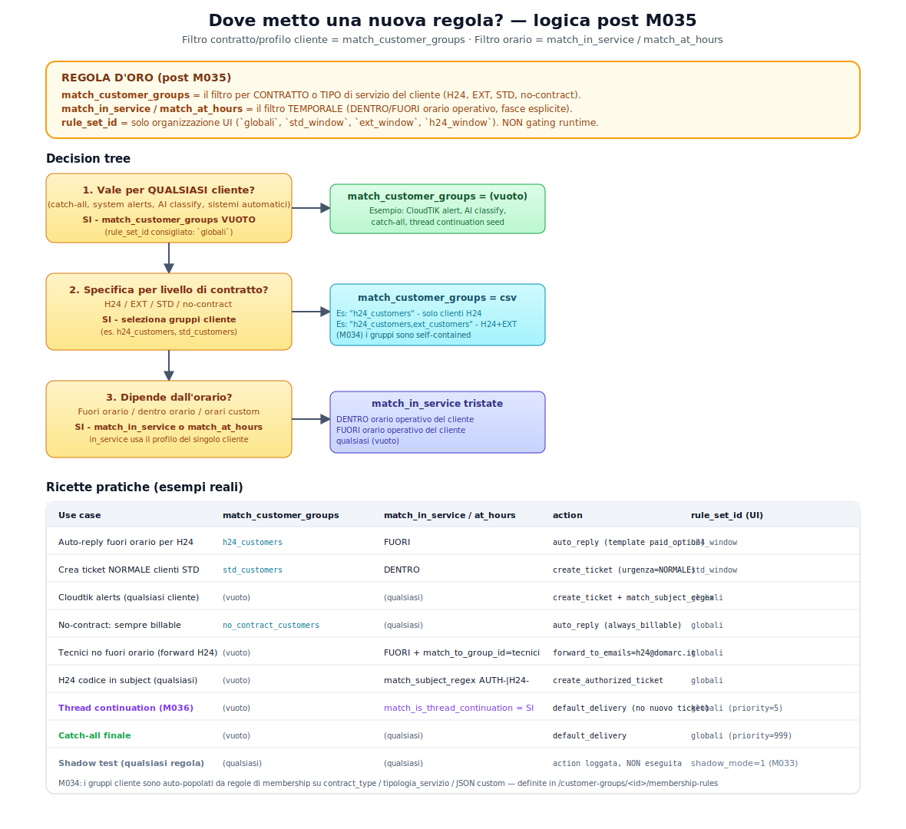

La regola d'oro post Migration 035:

- **Filtro per contratto/profilo del cliente** = `match_customer_groups`
  (CSV di gruppi cliente, es. `h24_customers,std_customers`).
- **Filtro per finestra temporale** = `match_in_service` (DENTRO orario
  operativo del cliente / FUORI / qualsiasi) + `match_at_hours`
  (override esplicito, es. `Mo-Fr 09:00-18:00`).
- **`rule_set_id`** = solo organizzazione UI per profilo orario
  (`globali`, `std_window`, `ext_window`, `h24_window`). NON è più
  gating runtime.

Tradotto in pratica:

- Se la regola è valida per **qualsiasi cliente** (es. CloudTIK alert, AI classify, sistemi automatici, catch-all): NON mettere `match_customer_groups`.
- Se la regola dipende **dal contratto** del cliente (es. tariffa straordinario, escalation H24, template dedicato): seleziona uno o più gruppi cliente in `match_customer_groups`. I gruppi sono auto-popolati dalle membership rules (M034) in base ai campi del cliente.
- Se la regola dipende **dall'orario**: usa `match_in_service` (DENTRO/FUORI orario operativo del cliente). La gerarchia STD ⊂ EXT ⊂ H24 è gestita automaticamente perché `in_service` legge il profilo del cliente.
- **In dubbio? Lascia `match_customer_groups` vuoto**. Si applica a tutti.

I rule_sets restano per **organizzare visivamente** le regole nei tab
della UI per profilo orario, ma la decisione di quali regole vengono
valutate dipende solo dai `match_*` dei singoli record.

#### Gruppi cliente self-contained (M034)

In `/customer-groups/<id>/membership-rules` definisci regole di
auto-assegnamento basate sui campi del cliente (`contract_type`,
`tipologia_servizio`, JSON custom). Esempio:

- Gruppo `h24_customers`:
  - regola: `tipologia_servizio = H24`
- Gruppo `std_customers`:
  - regola: `tipologia_servizio = STD` OR `tipologia_servizio NULL`

Il sistema ricalcola le membership ogni 5 minuti o quando un cliente
viene aggiornato. Eliminata la dipendenza dal manager esterno per la
composizione dei gruppi.

#### Shadow mode (M030/M031/M033)

Per testare una nuova regola senza far eseguire l'azione: spunta
**Shadow mode** sul form regola. Il sistema valuta tutto, registra
nell'evento `shadow_action` e `shadow_rule_id`, ma esegue solo
`default_delivery`. In `/events` vedi cosa **sarebbe successo** se la
regola fosse stata live.

Cascata applicabile a tre livelli:
- **Dominio** (`/integrations/`/Domini): tutto il traffico del dominio in shadow.
- **Gruppo destinatari** (`/recipient-groups/`): solo i destinatari del gruppo.
- **Singola regola** (`/rules/`): solo quella regola.

Use case: porti in produzione una nuova regola, la lasci in shadow per
qualche giorno, controlli `events_log` per vedere se avrebbe fatto le
cose giuste — quando sei sicuro togli il flag.

---

## 2. Accesso e ruoli

### Come si accede

Apri il browser su `https://manager-dev.domarc.it` (o IP/host del server) e inserisci utenza e password.


### Ruoli disponibili

| Ruolo | Cosa può fare |
|---|---|
| **viewer** | Vedere tutto (sola lettura). Per analisti che osservano senza toccare. |
| **operator** | Crea/modifica regole, gruppi clienti, gruppi destinatari, codici H24. **Non** può modificare utenti né settings critici. |
| **admin** | Tutto: utenti, settings, privacy bypass, kill switch, provider IA, ruoli. |
| **superadmin** | Multi-tenant: gestisce più tenant. Per istanze condivise. |

I permessi sono cablati nel decoratore Flask `@login_required(role=...)` e applicati lato backend, non solo nei template.

---

## 3. Dashboard


Mostra a colpo d'occhio:

- **KPI** (eventi 24h, regole attive, code outbound, quarantena, decisioni IA)
- **Kill switch**: quando attivato bypassa l'intero rule engine + IA per emergenze (es. picco di errori da nuovo binding IA). Resetta manualmente.
- **Box manuali**: link al manuale utente (questa pagina), manuale tecnico auto-generato e changelog.
- **Stato servizi**: listener / scheduler / connessioni DB / sync clienti / sync regole.

---

## 4. Le regole — il cuore del sistema

Le regole sono il meccanismo che decide il destino di ogni mail. Sono ordinate per **priorità** (numero più basso = più alta) e valutate in sequenza: **vince la prima che matcha** (a meno di `continue_after_match=true`).


### 4.1 Anatomia di una regola

Una regola è composta da:

**Identità**
- `name`, `description` (note dettagliate visibili in tooltip)
- `priority` (1-9999), `enabled` (on/off)
- `scope_type` + `scope_ref`: limita la regola a un tenant / cliente / dominio specifico

**Criteri di match** (AND tra loro — tutti devono essere soddisfatti)

| Campo | Tipo | Esempio |
|---|---|---|
| `match_from_regex` | regex | `(?i)^noreply@.*\.cloudtik\.it$` |
| `match_from_domain` | dominio esatto | `cliente.it` |
| `match_to_regex` | regex sul destinatario | `(?i)^h24@` |
| `match_to_domain` | dominio del To | `datia.it` |
| `match_subject_regex` | regex sull'oggetto | `(?i)urgente\|critico` |
| `match_body_regex` | regex sul body | `backup failed` |
| `match_at_hours` | finestra oraria | `mon-fri 09:00-18:00` |
| `match_in_service` | tristate | True (in orario) / False (fuori) / NULL |
| `match_contract_active` | tristate | True / False / NULL (indifferente) |
| `match_known_customer` | tristate | True (cliente noto) / False (sconosciuto) |
| `match_has_exception_today` | tristate | True (cliente con eccezione oggi) |
| `match_customer_groups` | CSV | `top_customer,settore_sanita` |
| `match_to_group_id` | FK gruppo destinatari (Migration 027) | "Tecnici no fuori orario" |
| `match_tag` | tag custom | `monitoring` |

> **Vincolo:** `match_to_regex` e `match_to_group_id` sono **alternative esclusive**. Se valorizzi entrambi, il salvataggio fallisce con errore esplicito. Scegli una sola modalità di matching del destinatario.

**Azione e parametri**

| Campo | Descrizione |
|---|---|
| `action` | `forward` / `auto_reply` / `create_ticket` / `quarantine` / `ai_classify` / `ignore` / ... |
| `action_map` | JSON con parametri specifici dell'azione (es. `{"template_id": 7, "auth_code_ttl_hours": 24, "urgent_fee": 250, "generate_auth_code": true}`) |
| `forward_to_emails` | Lista destinatari separati da `;` (override degli rcpt originali) |
| `forward_to_group_id` | FK gruppo destinatari → espanso in N indirizzi al momento dell'invio |
| `severity` | `info` / `warn` / `error` (per filtri) |
| `continue_after_match` | se true, dopo questa regola valuta anche le successive |

**Gerarchia (Rule Engine v2)**

- **Regole orfane**: criteri propri, valutate al loro turno.
- **Gruppi (`is_group=1`)**: contengono criteri di match condivisi. Quando il gruppo matcha, vengono valutati i suoi figli.
- **Figli di gruppo (`parent_id != NULL`)**: ereditano `match_*` dal padre, possono raffinare (es. il padre matcha "from = cloudtik.it", il figlio aggiunge "subject contiene backup failed"). I figli ereditano anche `action_map` con `deep_merge` (i campi del figlio sovrascrivono quelli del padre).
- `exclusive_match=1`: nel gruppo vince un solo figlio (default).
- `continue_in_group=1`: dopo un figlio matchato, valuta anche gli altri figli.
- `exit_group_continue=1`: dopo aver finito col gruppo, valuta anche le regole successive al gruppo.

### 4.2 Form di creazione/modifica regola

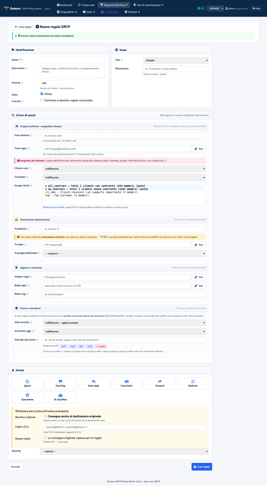

Tutti i campi hanno **balloon contestuali** (icona ⓘ a destra dell'etichetta) che si aprono **a destra** con descrizione dettagliata + esempio. Leggili sempre prima di compilare.

#### Esempio pratico — "Tecnici no fuori orario → catchall H24"

**Scopo**: i tecnici Mario, Luca, Paolo non devono ricevere mail di assistenza fuori orario. Tutte le mail destinate a uno di loro tra le 18:00 e le 9:00 vanno ridirette a `h24@datia.it`.

1. Crea il gruppo destinatari su [/recipient-groups/new](/recipient-groups/new): codice `tecnici_no_fo`, membri `mario@datia.it; luca@datia.it; paolo@datia.it`.
2. Crea la regola con:
    - `match_to_group_id` = `tecnici_no_fo`
    - `match_in_service` = **False** (fuori orario)
    - `priority` = 50 (alta, deve scattare prima delle regole generiche)
    - `action` = `forward`
    - `forward_to_emails` = `h24@datia.it`
3. Salva. Il listener riceverà il sync entro 5 min e applicherà la regola.

### 4.3 Validazione e tooltip

Il sistema rifiuta in salvataggio:
- regex sintatticamente invalide (V001)
- almeno un `match_*` deve essere valorizzato (orfani senza criteri sono catch-all pericolosi — V003)
- gruppi (`is_group=1`) senza match condivisi (V004)
- priorità duplicata nello stesso scope (UNIQUE constraint)
- `match_to_regex` + `match_to_group_id` insieme

### 4.4 Test e simulazione

Prima di abilitare una regola, dal form puoi:
- testare la regex contro un testo di esempio (pulsante "Test" accanto a ogni regex)
- usare la pagina `/rules/<id>/simulate` per vedere come la regola si comporterebbe su un evento reale già nel DB.

### 4.5 Flusso decisionale completo per una mail

Il listener processa ogni mail in cascata (stop al **primo** match, salvo flag `continue_*`):

```
Mail SMTP → Listener
   │
   ├─ Privacy bypass list?       → SCARTA senza log (GDPR)
   │
   ├─ Decode subject RFC 2047    (Unicode pulito, no doppio encoding)
   ├─ Extract attachments + body
   ├─ Resolve customer (codcli, contract_active, profile) tramite alias
   │
   ├─ Autodiscovery: upsert addresses_from + addresses_to
   │
   ├─ FOR rule IN rules ordered by priority:
   │     ├─ matcha tutti i criteri AND? (regex, dominio, gruppi cliente,
   │     │  match_to_group_id, orari, contract_active, ...)
   │     ├─ NO  → next
   │     └─ SÌ →
   │            ├─ se rule.is_group → valuta children con deep_merge action_map
   │            ├─ override automatico template a always_billable_no_contract
   │            │  se cliente ha contract_active=False
   │            ├─ esegui action: forward / auto_reply / create_ticket /
   │            │  create_authorized_ticket / quarantine / ai_classify / ignore
   │            └─ se continue_after_match=False → STOP
   │
   ├─ Nessuna regola matcha → default = ignore (con log)
   │
   └─ Sempre: persisti event + sync verso admin via API per audit
```

Le decisioni sono **deterministiche** quando non c'è azione `ai_classify` (priorità + criteri sono trasparenti e replicabili). L'IA entra solo dove configurata.

---

## 5. Anagrafica clienti, gruppi clienti e orari di servizio

### 5.1 Clienti


La tabella `customers` è **autoritativa** (Migration 028) e
alimentata da feed esterni configurabili (vedi §5.4 Customer sync).
Per ciascun cliente:

- `codcli` + `ragione_sociale`
- `domains` + `aliases` (su quali indirizzi mail ricade)
- `contract_active` (True/False) e `contract_type` (HW/SW/MS/...)
- `availability_type` (profilo orario: STD = standard 9-18, EXT = esteso 8-20, H24 = 24h, NO = no orario)
- `service_hours` (eventuali orari custom + eccezioni date)
- `last_synced_from_source_id` (sorgente che ha aggiornato il record per ultima)

**Filtri avanzati** in alto: ricerca testo (mode AND/OR/NOT), profilo (IN/NOT IN), tipo contratto (IN/NOT IN), stato contratto (attivo/no), gruppo (IN/NOT_IN). I filtri sono combinabili.

**Bulk action**: seleziona multiple righe → "Aggiungi a gruppo esistente" o "Crea nuovo gruppo". Le selezioni persistono durante i filtri.

**Rappresentazione coerente del profilo orario**:
- contratto attivo + profilo assegnato → badge profilo (STD/EXT/H24)
- contratto attivo ma profilo NULL → "profilo non assegnato" (warning)
- contratto non attivo → "sempre a pagamento" (rosso) — qualunque richiesta è billable

### 5.2 Gruppi clienti (self-contained, M034)

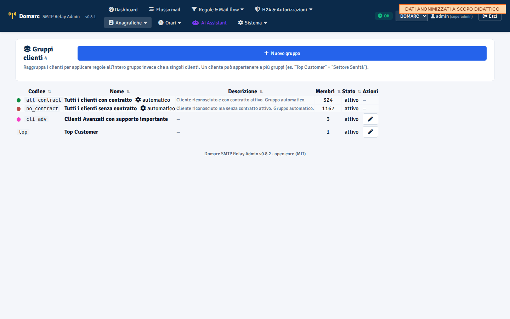

Raggruppamenti logici (es. "Top customer", "Settore sanità", "H24
contract", "Std contract"). Un cliente può appartenere a più gruppi.
Usati come criterio nel campo regola `match_customer_groups` — dopo
M035 sono **l'unica chiave di filtro per contratto/profilo** nelle
regole.

**Membership rules (M034)**: i gruppi sono **self-contained**, ovvero
i membri vengono auto-assegnati in base a regole sui campi del
cliente. In `/customer-groups/<id>/membership-rules`:

| Campo | Operatore | Valore |
|---|---|---|
| `contract_type` | `=` | `HW` |
| `tipologia_servizio` | `IN` | `H24,EXT` |
| `JSON.settore` | `=` | `sanita` |
| `domains_json` | `contains` | `asl` |

Il sistema ricalcola le membership ogni 5 minuti o on-customer-update
via `recompute_group_memberships(group_id)`. Pulsante "Ricalcola
adesso" forza il refresh.

**Vantaggio**: non dipendi più dal manager esterno per la composizione
dei gruppi. La logica vive interamente nel relay.

### 5.4 Customer sync agnostico (M028)

In `/customer-sync/` configuri le **sorgenti** che alimentano la
tabella clienti. La sorgente "Postgres solution Domarc" è seedata di
default e usa la connessione PG configurata in `/integrations/`.

**Provider supportati**:
- `postgres` (PostgreSQL via `psycopg2`)
- `mssql` (SQL Server via `pyodbc`)
- `csv_file` (file CSV su filesystem del relay)
- `json_url` (REST API che ritorna array JSON, con JSONPath per estrarre)

**Wizard 4-step**:
1. **Tipo**: scegli il provider.
2. **Connessione**: host/port/credenziali (cifrate con Fernet) o
   path/URL.
3. **Test**: connessione + preview prime 10 righe della query/file.
4. **Mapping & schedule**:
   - Mapping field-by-field con modalità Semplice (dropdown) o
     Avanzata (JSON). Pulsante "Scopri schema dalla sorgente"
     auto-compila le opzioni source.
   - Schedule (default 24h).
   - On_missing policy: `flag` (default, `contract_active=0`),
     `delete`, `keep`.

**Campi target supportati** (contratto canonico):
- `codcli` (PK, obbligatorio)
- `ragione_sociale`, `contract_active`, `tipologia_servizio`,
  `contract_type`, `contract_expiry`, `domains` (list), `aliases`
  (list), `timezone`, `service_hours_json` (dict)

**Trasformazioni mapper**: `lowercase`, `strip`, `default:<v>`,
`split:<sep>`, `bool`, `json_parse`, `coalesce:<col1,col2>`.

**Trigger manuale**: bottone "Esegui adesso" (con flag dry-run per
preview senza scrivere).

**Storico run** in `/customer-sync/<id>/runs`: status (ok / error /
partial), n_fetched, n_inserted, n_updated, n_unchanged,
n_flagged_missing, n_errored, error_message, triggered_by.

### 5.3 Orari di servizio + eccezioni

(numerazione storica mantenuta — §5.4 customer sync inserito sopra)


Per cliente puoi definire:
- override del profilo orario (es. cliente con profilo H24 ma alcune fasce STD)
- eccezioni date (es. chiusura per ferie 15-22 agosto, festa patronale)

Il rule engine valuta `match_in_service` confrontando il timestamp con il profilo del cliente del **mittente** (non del destinatario).

### 5.4 Profili orari


Anagrafica dei profili (STD/EXT/H24/NO + custom). Ogni profilo ha:
- schedule settimanale (lun-dom, fasce orarie)
- holidays (giorni festivi nazionali via libreria `holidays` Python)
- flag `requires_authorization_always` (per profilo NO)
- flag `authorize_outside_hours` (per profilo H24 paid)

---

## 6. Destinatari & gruppi destinatari (Migration 025)

Pattern gemello a "Gruppi clienti" ma applicato a **indirizzi mail dei destinatari** (non clienti). Use case principale: **routing mail tecnici fuori orario verso catchall H24** senza disturbarli.

### 6.1 Destinatari noti — bulk action

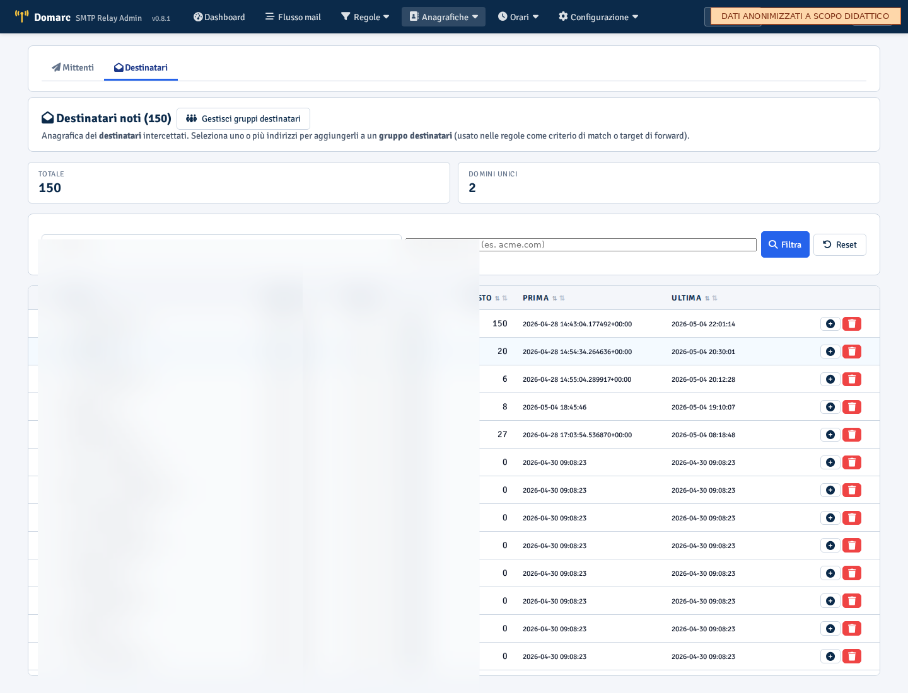

La pagina **Indirizzi → Destinatari** (`/addresses-to`) elenca tutti gli indirizzi destinatari intercettati dal listener (autodiscovery). Per ogni indirizzo:
- `email_address` + `domain`
- `seen_count` (occorrenze)
- `first_seen_at` / `last_seen_at`
- `codice_cliente` (se mappato)

**Bulk action**:
1. Spunta i checkbox accanto agli indirizzi che vuoi raggruppare
2. Compare la barra azione blu in alto:
    - **➕ Aggiungi a gruppo esistente**: dropdown con i gruppi → conferma
    - **👥 Crea nuovo gruppo**: form inline con codice/nome/descrizione/colore

Niente filtri elaborati: la ricerca testo + il filtro per dominio sono sufficienti per trovare gli indirizzi che ti interessano.

### 6.2 Gruppi destinatari

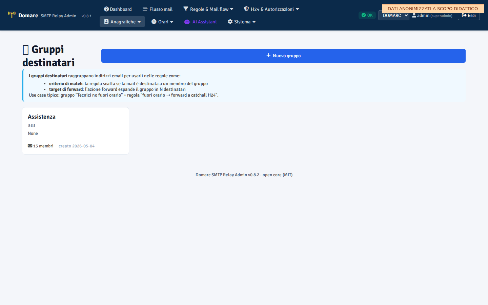

Card grid dei gruppi attivi (stesso pattern di "Gruppi clienti"). Click su un gruppo → form di gestione: rimuovi membri (deselezionando la checkbox) o aggiungi indirizzi liberi via textarea (separati da spazio/virgola/`;`/newline).

### 6.3 Uso nelle regole

I gruppi destinatari sono usati nelle regole come:

- **criterio di match**: `match_to_group_id` → la regola scatta se uno dei destinatari è nel gruppo
- **target di forward**: `forward_to_group_id` o `forward_to_emails` (lista `;`) → l'azione `forward` espande il gruppo in N rcpt

Vedi §4.2 per l'esempio "Tecnici no fuori orario → catchall H24".

---

## 7. H24 — autorizzazioni interventi fuori orario

Il flusso H24 gestisce le richieste di intervento **fuori orario di servizio**, distinguendo:

- **Codici monouso (oneshot)**: generati al momento, validi 24-48h, una sola volta. Tipicamente a pagamento. Spediti via mail al richiedente, che li ritorna in oggetto sulla mailbox H24 per autorizzare.
- **Codici permanenti**: assegnati a un cliente specifico (es. `DOMARC-DATIA`), riutilizzabili, contrattuali (no addebito). Mantengono storico utilizzi.

### 7.0 Panoramica unificata — `/codes-h24/`

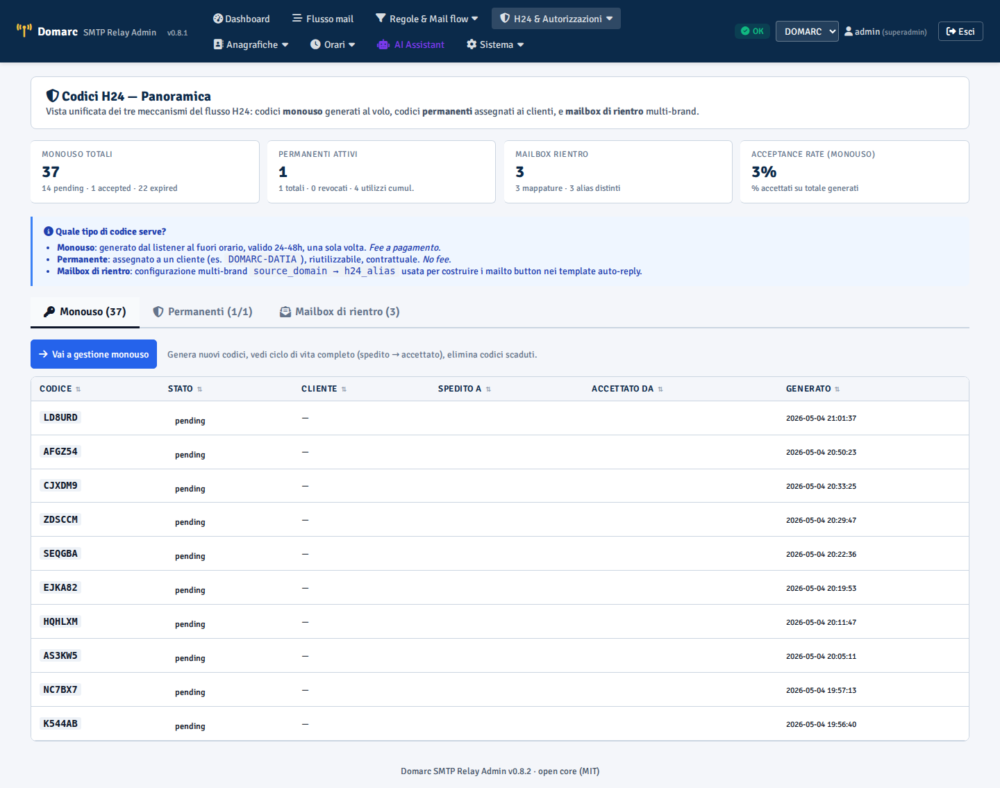

Pagina di ingresso per tutto il flusso H24 con KPI consolidati e 3 tab:

- **Tab Monouso** — top 10 codici recenti con stato (pending/accepted/expired)
- **Tab Permanenti** — top 10 codici cliente con utilizzi cumulativi
- **Tab Mailbox** — mappature multi-brand source_domain → h24_alias

Da qui il drill-down porta alle pagine specifiche dove si possono generare/revocare codici, modificare le mailbox H24 inline, vedere i dettagli body delle mail di richiesta.

### 7.1 Codici monouso — ciclo di vita

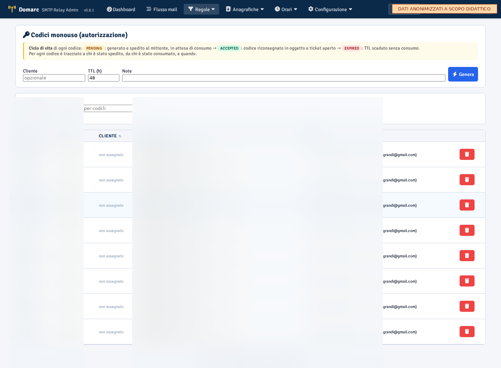

Ogni codice attraversa stati ben definiti:

| Stato | Significato |
|---|---|
| `pending` | Generato, in attesa di consumo |
| `accepted` | Riconsegnato in oggetto e ticket aperto |
| `expired` | TTL scaduto senza consumo |
| `canceled` | Annullato manualmente |

Per ogni codice è tracciato:
- **Generato** il `generated_at`
- **Spedito a** `sent_to_email` il `sent_at` (popolato dal listener al momento dell'invio del template auto-reply)
- **Accettato da** `accepted_by_email` il `accepted_at` (popolato quando il codice viene consumato — può essere un indirizzo diverso dal mittente originale!)
- **Ticket** `ticket_id` (se aperto)

Esempio reale: codice `7XK29M` generato e spedito a `mario@datia.it` il 2026-05-04 22:00 (state=pending). Mario lo gira a Paolo, che risponde alle 22:15 con il codice in oggetto da `paolo@datia.it` → state=accepted, accepted_by=paolo@datia.it, ticket aperto. La UI mostra TUTTO il ciclo, non solo "usato/non usato".

### 7.2 Codici permanenti — storico utilizzi

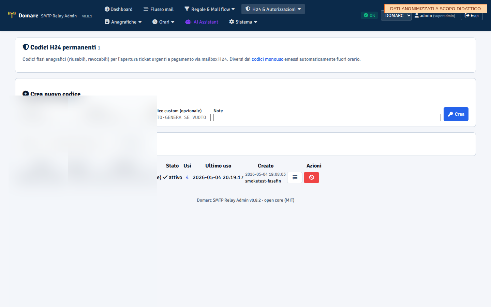

Lista codici cliente (assegnati a `codcli`) con: contatore utilizzi, ultimo utilizzo, stato (attivo/revocato/disabilitato). Click su un codice → tab "Utilizzi" con tabella cronologica completa.

Per ogni utilizzo è registrato:
- `used_at`, `from_email` (mittente che ha usato il codice)
- `subject` della mail
- `body_excerpt` (primi 4000 caratteri del corpo, **espandibile** cliccando "Mostra/nascondi corpo")
- `inbound_alias` (mailbox H24 che l'ha ricevuto, per multi-brand)
- `event_uuid` (link all'evento) e `ticket_id`
- `reported_to_manager_at` (quando lo scheduler ha riportato al gestionale)

Use case: codice `DOMARC-DATIA` usato 18 volte negli ultimi 6 mesi → la tabella mostra tutte le 18 mail con drill-down sul corpo per audit "chi ha chiesto cosa quando".

### 7.3 Mailbox di rientro H24 (multi-brand)

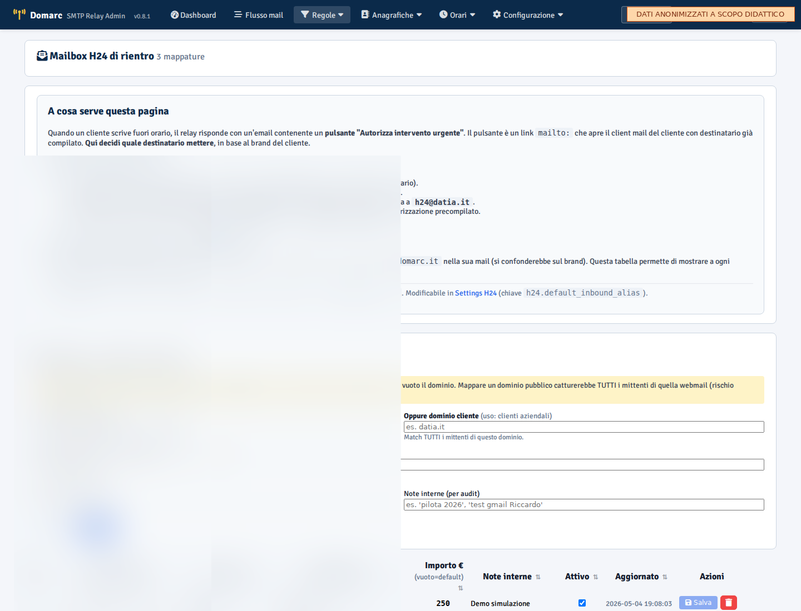

Per il multi-brand: se gestisci più brand (Domarc, OptiWize, Datia), ognuno ha la sua mailbox H24 (`h24@domarc.it`, `h24@optiwize.it`, `h24@datia.it`). La tabella mappa `source_domain` o `source_email` (più specifico, override del dominio) → `h24_alias` + `urgent_fee_eur`.

**Le righe sono editabili inline**: modifica un valore e salvi solo quella riga (highlight giallo per modifiche non salvate, verde dopo salvataggio).

### 7.4 Template H24

I template di auto-reply per il flusso H24 sono:

- `out_of_hours_with_paid_option` (id 7) — fuori orario, propone codice monouso a pagamento (default 250 €)
- `out_of_hours_no_paid_option` (id 8) — fuori orario, no pagamento possibile (rifiuto)
- `h24_ack` (id 9) — conferma ticket aperto dopo validazione codice
- `h24_already_used` (id 10) — codice già usato
- `h24_reject` (id 11) — codice non valido
- `always_billable_no_contract` (id 12) — **NUOVO**: cliente identificato senza contratto attivo, ogni intervento è billable

L'override `always_billable_no_contract` viene applicato **automaticamente** dal listener: se rileva `customer.contract_active=False` su un mittente identificato, sostituisce qualunque altro template configurato sulla regola.

---

## 8. Cronologia eventi e Activity live

### 8.1 Eventi


Ogni mail processata è loggata con:
- timestamp, mittente, destinatario, subject, message_id
- `codice_cliente` (se risolto), `action_taken`, `rule_id` (regola che l'ha matchata)
- `ticket_id` (se aperto)
- `payload_metadata` JSON con dettagli extra (es. flag `ai_unavailable=true` se l'IA è andata in fail-safe)
- body_text + body_html (con TTL configurabile per GDPR)

Filtri: range data, mittente, destinatario, action_taken, rule_id, codcli. Click su una riga → dettaglio evento con preview body.

### 8.2 Activity live


Stream realtime degli eventi via WebSocket. Mostra le ultime 50 mail in arrivo con auto-refresh. Utile in fase di troubleshooting o durante deploy di nuove regole.

---

## 9. Coda e quarantena


- **Outbound queue**: mail da rispedire (forward/redirect) verso lo smarthost (es. SMTP cliente). Sistema di retry con backoff esponenziale. Visualizza stato (queued/sending/done/failed), tentativi, prossimo retry.
- **Quarantine**: mail messe in quarantena dalle regole. Da revisionare manualmente. Azioni possibili: rilascia (ri-processa), elimina, marca come spam.

---

## 10. Intelligenza Artificiale (IA) — integrazione completa

L'IA in Domarc SMTP Relay **non sostituisce** il rule engine deterministico ma lo **affianca**. Il rule engine resta autoritativo per le mail con pattern noti; l'IA interviene quando:

1. una regola ha `action='ai_classify'` (decisione semantica)
2. shadow mode è attivo (per imparare da quanto fa il rule engine)
3. una regola usa `action='ai_critical_check'` (gate di sicurezza pre-azione)
4. il modulo error aggregator vuole clusterizzare errori semantici (es. "backup failed srv01" e "backup error host01" sono lo stesso problema)
5. il rule proposer analizza decisioni IA ricorrenti e propone regole statiche per ridurre nel tempo le chiamate IA

### 10.0 Ciclo di vita di una decisione AI

```
   Mail in arrivo
        │
        ▼
   [Rule Engine deterministico]   ←── prima linea (sempre)
        │
        ├─ matcha → azione applicata, fine.
        │
        └─ regola con action=ai_classify (o shadow attivo)
                │
                ▼
        [PII Redactor: regex IT + spaCy NER + dizionario custom]
                │  (tutti i PII rimossi prima di toccare l'API)
                ▼
        [AI Router] → lookup binding per job_code
                │  - bilancia traffico A/B se più binding attivi
                │  - timeout 5s, fallback su provider secondario
                ▼
        [Provider Claude (Haiku/Sonnet) o DGX locale]
                │
                ├─ OK → output strutturato (classification, urgenza, summary)
                │       │
                │       ▼
                │   [Decision storage: ai_decisions]
                │       - prompt_hash per cache
                │       - cost_usd, latency_ms, token in/out
                │       - pii_redactions_count
                │       - applied=true se NON shadow, false se shadow
                │       │
                │       ▼
                │   [Action dispatcher applica la decisione (se non shadow)]
                │
                └─ TIMEOUT/ERROR → [Fail-safe]
                                    - forward a ai-fallback@domarc.it
                                    - ticket urgenza ALTA, ai_unavailable=true
                                    - operatore gestisce manualmente
```

Tutte le decisioni sono **immutabili** in `ai_decisions` (audit completo). Lo shadow mode permette di osservare l'IA per giorni prima di darle controllo effettivo.

### 10.1 Dashboard IA


KPI principali:
- decisioni IA nelle ultime 24h
- distribuzione per `job_code` (classify_email, summarize, critical_classify, ...)
- costo cumulativo USD (Anthropic API)
- latenza p50/p95
- shadow mode on/off (toggle globale)
- top patterns (mittenti/oggetti più frequenti)

### 10.2 Routing modelli per job


Cuore dell'integrazione: ogni *tipo di lavoro* (`job_code`) ha il suo binding modello. Es:

| Job | Modello default | Quando |
|---|---|---|
| `classify_email` | claude-haiku-4-5 | Classificazione mail in arrivo (priorità/intent) |
| `summarize` | claude-haiku-4-5 | Riassunti per ticket |
| `critical_classify` | claude-sonnet-4-6 | Decisioni critiche (escalation a modello migliore) |
| `error_embedding` | embedding locale (DGX) | Clustering errori semantici |
| `rule_proposal` | claude-haiku-4-5 | Proposta regole statiche dal learning loop |
| `pii_ner_assist` | spaCy `it_core_news_sm` (locale) | Riconoscimento entità nomi propri italiani |

Da `/ai/models` puoi:
- creare/modificare binding (provider + modello + prompt template + temperature + max_tokens + timeout)
- versionare i binding (storico modifiche, rollback)
- traffic split A/B (es. 80% Haiku, 20% Sonnet) per testare un nuovo modello in produzione
- definire fallback provider/modello (se Claude API timeout → DGX locale)

### 10.3 Provider IA


Configurazione dei provider disponibili:
- `claude_api` (Anthropic, API key in env `ANTHROPIC_API_KEY`)
- `local_http` (DGX Spark / Ollama / vLLM con endpoint OpenAI-compatible) — Fase 4
- test connettività inline ("Verifica" dal pulsante Test)

### 10.4 Decisioni IA


Log completo di ogni inferenza:
- `event_uuid` (mail correlata), `job_code`, `binding_id`, provider, modello
- `prompt_hash` (per cache), `pii_redactions_count` (quante PII rimosse prima di Claude)
- output strutturato: `classification`, `urgenza_proposta`, `intent`, `summary`
- `latency_ms`, token in/out, **`cost_usd`**
- flag `applied` (decisione applicata) vs `shadow_mode` (solo loggata, rule engine ha agito normalmente)
- `applied_by` (per audit)

Filtri: job_code, classification, applied/shadow, range date.

### 10.5 Shadow mode (essenziale per il rollout)

Setting globale `ai_shadow_mode` (default ON al primo deploy). Quando attivo:
- l'IA viene comunque interpellata per le regole con `action='ai_classify'`
- la sua decisione viene **loggata** in `ai_decisions` ma **non applicata**
- il rule engine continua a usare le sue regole deterministiche
- l'operatore può confrontare in `/ai/decisions` cosa avrebbe fatto l'IA con cosa ha fatto effettivamente il rule engine
- dopo qualche giorno di osservazione, se la qualità è soddisfacente → setting `ai_shadow_mode=false` per andare live

Audit: il cambio di shadow_mode è tracciato (chi/quando) per accountability.

### 10.6 Cluster errori IA


Sostituisce le `error_aggregations` deterministiche con dedup **semantica** basata su embedding (default `paraphrase-multilingual-MiniLM-L12-v2`, 384 dim, italiano-friendly).

Per ogni cluster:
- `representative_subject` + `body_excerpt`
- `count` (numero di occorrenze), `first_seen` / `last_seen`
- `manual_threshold` (default 5, modificabile UI): dopo quante occorrenze aprire il ticket aggregato
- `manual_recovery_window_min` (default 60): finestra entro cui un evento di "recovery/cleared/resolved" chiude il cluster
- `state`: `accumulating` / `ticket_opened` / `recovered`
- link al ticket aperto (se opened)

L'IA classifica anche i messaggi di rientro (es. "backup recovered srv01" → marca cluster recovered, chiude ticket).

### 10.7 Proposte regole IA (learning loop)


Worker async che analizza `ai_decisions` raggruppando per pattern coerente: se ≥ N decisioni simili (default 20) hanno classificazione consistente, il sistema **propone una regola statica** che potrebbe sostituire l'IA su quel pattern.

Per ogni proposta:
- `suggested_match_*` (regex/dominio derivati dai pattern delle decisioni)
- `suggested_action` + `suggested_action_map`
- `confidence` (0.0-1.0)
- `evidence_decision_ids` (lista degli ID decisioni che hanno generato la proposta)
- stato: `pending` / `accepted` / `rejected` / `archived`

L'operatore review: accept → la regola viene creata in `rules` (con `created_by='ai_proposal_<id>'`); reject → archiviata. Le mail successive con quel pattern matcheranno la regola statica → no più chiamate IA → riduzione costi nel tempo.

### 10.8 PII Redactor

Pipeline di anonimizzazione applicata **prima di ogni chiamata Claude**:
1. Regex: IBAN, codice fiscale, P.IVA, telefono, email, URL+token
2. spaCy `it_core_news_sm`: nomi propri (PER), aziende (ORG), località (LOC)
3. Dizionario custom `ai_pii_dictionary` (gestibile da `/ai/pii-dictionary` per aziende/prodotti specifici del cliente)

Test garantisce: nessun PII residuo nel testo che esce dall'admin verso l'API Claude. La sostituzione usa placeholder generici (`<PERSONA_1>`, `<AZIENDA_2>`, `<IBAN>`).

### 10.9 Fail-safe

Se Claude non risponde (timeout 5s, rate limit, errore API):
- la mail viene **forwardata** a `ai-fallback@domarc.it` (configurabile via setting)
- viene aperto un ticket urgenza ALTA con flag `ai_unavailable=true` in `payload_metadata`
- l'operatore intercetta e gestisce manualmente

Cost cap: setting `ai_daily_budget_usd` (default $50). Quando raggiunto, nuove chiamate falliscono con `budget_exhausted` → fail-safe path. Reset alle 00:00 UTC.

---

## 11. Template di risposta


Template Jinja2 per le risposte automatiche. Variabili disponibili nel contesto:
- `subject`, `from_address`, `received_at`
- `codice_cliente`, `ragione_sociale`, `contract_active`
- `auth_code`, `auth_code_valid_until`, `auth_code_ttl_hours` (per template H24)
- `h24_inbound_alias`, `urgent_fee` (multi-brand)
- `h24_billable` (bool: monouso=true, permanente=false)

### 11.1 Editor HTML con preview live

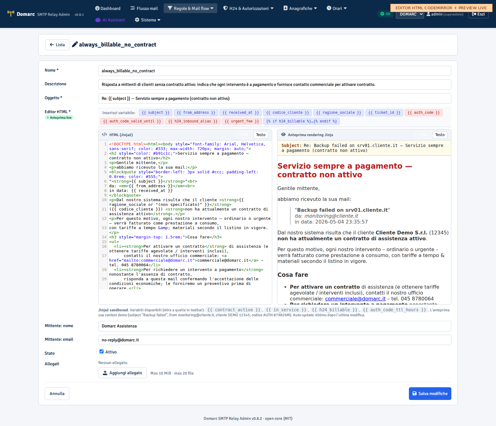

Il form di modifica template ha un **editor HTML con syntax highlighting** (CodeMirror 5) affiancato da un'**anteprima live** che renderizza il template Jinja con context demo aggiornandosi 600ms dopo l'ultima modifica.

Funzionalità:
- **Editor CodeMirror** con `htmlmixed` mode: highlight HTML/CSS/JS, indentazione automatica, `autoCloseTags`, line numbers, line wrapping.
- **Toolbar variabili Jinja**: pulsanti che inseriscono al cursore le variabili comuni (`{{ subject }}`, `{{ from_address }}`, `{{ auth_code }}`, ecc.). Le H24-related sono in rosso per distinguerle.
- **Anteprima iframe sandbox**: rendering del template con contesto demo realistico (mail di alert "Backup failed", cliente "Demo SrL", codice "AUTH-87XK29M"). Sandbox per sicurezza.
- **Preview testo**: tab dedicato per `body_text_tmpl` (versione plain text).
- **Anteprima subject**: preview del subject renderizzato con le variabili sostituite, in alto.
- **Errori Jinja**: se il template ha errori di sintassi, vengono mostrati in banner rosso senza bloccare l'editor.
- **Badge "live"**: verde quando preview aggiornata, ambra durante il typing.

Endpoint backend: `POST /templates/preview` (esentato CSRF perché idempotente, solo render in memoria).

Template di sistema (non eliminabili):

| ID | Nome | Uso |
|---|---|---|
| 2 | `cliente_senza_contratto` | Mittente non identificato come cliente con contratto |
| 3 | `out_of_hours_assistenza` | Generico fuori orario |
| 7 | `out_of_hours_with_paid_option` | Fuori orario + bottone mailto codice monouso |
| 8 | `out_of_hours_no_paid_option` | Fuori orario senza opzione paid |
| 9 | `h24_ack` | Ack ticket aperto post-validazione codice |
| 10 | `h24_already_used` | Codice già usato |
| 11 | `h24_reject` | Codice non valido |
| 12 | `always_billable_no_contract` | Cliente identificato ma senza contratto: sempre billable |

Editor inline con preview HTML + text. Rendering test su evento di esempio.

---

## 12. Privacy bypass list

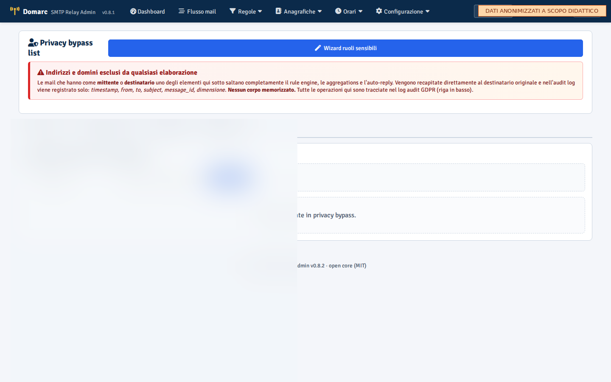

Lista di indirizzi/domini **esclusi totalmente** dal rule engine e dall'IA. Le mail che hanno un mittente o destinatario nella lista vengono scartate **prima** ancora di essere registrate nel DB.

Use case: clienti GDPR-sensitive (medici, legali, privati con dati sanitari) per cui non è ammesso persistere il body. Solo gli admin possono gestire la lista.

Tipi di entry:
- `from_email` (mittente esatto)
- `to_email` (destinatario esatto)
- `from_domain` (intero dominio mittente)
- `to_domain` (intero dominio destinatario)

---

## 13. Utenti, ruoli e sicurezza


Gestione utenze:
- creazione utente (username + password + ruolo)
- reset password (genera password temporanea)
- abilitazione/disabilitazione (mantiene audit, evita perdita di accountability)
- LDAP opt-in (settings `auth.ldap.*`)

Audit log: ogni login + ogni operazione critica (modifica regole, kill switch, shadow mode toggle, eliminazione codici) è loggato in `access_login_audit` con `actor`, `action`, `target`, `timestamp`, `ip`.

---

## 14. Domande frequenti

### "L'IA classifica male, posso correggere?"

Sì. Vai in `/ai/decisions`, apri la decisione errata, marca come "wrong". Il sistema usa queste annotazioni per:
- calcolare accuracy stimata in dashboard
- escludere quelle decisioni dal rule_proposer (no falsi positivi)
- alimentare un eventuale futuro fine-tuning

Se il pattern è sistematico, **tuna il prompt** del binding del job: `/ai/models` → modifica binding → cambia `system_prompt_template` → versiona → testa A/B prima di promuovere.

### "Voglio disabilitare l'IA temporaneamente"

Tre livelli, dal più morbido al più aggressivo:
1. **Solo shadow**: `ai_shadow_mode=true` → IA loggata ma non applicata.
2. **Disabilita binding specifico**: `/ai/models` → toggle off del binding del job problematico.
3. **Kill switch globale**: dashboard → "Kill switch IA" → bypass completo. Da usare in emergenza.

### "Una regola non scatta, perché?"

Vai in `/rules/<id>/simulate` con un evento campione: il sistema mostra criterio per criterio cosa matcha e cosa no. Spesso il problema è:
- regex non case-insensitive (manca `(?i)`)
- priorità troppo bassa (regola precedente cattura prima)
- `match_in_service` non coerente con orari del cliente del mittente
- regola disabilitata (`enabled=0`)
- gruppo padre con `exclusive_match=1` che ha già matchato un altro figlio

### "Come funziona il sync admin → listener?"

Lo scheduler del listener (su VM 4.25) chiama ogni 5 min:
- `/api/v1/relay/customers/active` (1491 clienti)
- `/api/v1/relay/rules/active` (regole flat espanse da gruppi)
- `/api/v1/relay/customer-groups/active`
- `/api/v1/relay/recipient-groups/active` (Migration 027)
- `/api/v1/relay/h24-targets/active`
- `/api/v1/relay/templates/active`
- `/api/v1/relay/aggregations/active`
- `/api/v1/relay/privacy-bypass/active`
- ...

Le tabelle locali del listener (`*_cache`) vengono sostituite atomicamente. Latenza max prima che una modifica arrivi al listener: 5 min.

### "Un cliente non ha contratto. Come reagisce il sistema?"

Quando il listener identifica il mittente come cliente con `contract_active=False`:
1. Forza il template auto-reply a `always_billable_no_contract` (id 12), ignorando il template della regola
2. Nel ticket eventuale, `payload_metadata.no_contract=true`
3. La fee H24 (se applicabile) viene comunque calcolata, perché il cliente è già di per sé billable

Questo evita falsi "fuori orario" per clienti che non sono mai in orario contrattuale.

### "Cos'è successo al subject delle risposte? Vedevo `=?UTF-8?B?...?=` in chiaro"

Bug fixato in v0.9.0 (2026-05-04). Il parser ora decodifica RFC 2047 una sola volta in entrata (`email.header.decode_header` + `make_header`), così il subject originale è già Unicode pulito quando viene concatenato nei template. L'invio outbound applica un solo encoding nuovo (UTF-8 base64 standard) se necessario. Niente più doppio encoding.

### "Voglio cambiare il manager esterno che alimenta i clienti"

Vai in `/customer-sync/`. La sorgente "Postgres solution Domarc" è il
seed legacy che usa la connessione PG configurata in
`/integrations/`. Per svincolarti:

1. Crea una nuova sorgente (es. CSV file, MSSQL, JSON URL).
2. Configura il **mapping** dei campi (modalità Semplice con dropdown o
   Avanzata in JSON). Il bottone "Scopri schema dalla sorgente" auto-
   compila le opzioni source.
3. Test connessione + preview prime 10 righe.
4. Schedule (default 24h) + on_missing policy:
   - **flag** (default): clienti spariti dalla sorgente → `contract_active=0`. Audit conservato.
   - **delete**: clienti spariti vengono eliminati.
   - **keep**: clienti mai modificati dalla sorgente.
5. Quando la nuova sorgente funziona, **disabilita la sorgente legacy**
   in `/customer-sync/<id>/edit`.

Il primo run scatta entro 60s. Storico in `/customer-sync/<id>/runs`.

### "Una mail di risposta apre un nuovo ticket. Come evitare?"

Risolto da Migration 036 (Thread tracking RFC 2822). Quando il sistema
riceve una mail con `In-Reply-To` o `References` che match-ano un
`message_id` di un evento già tracciato, la regola seed "Thread
continuation — passa al destinatario" (priority=5 in rule_set
`globali`, azione `default_delivery`) si attiva e l'evento NON apre un
nuovo ticket. Il `ticket_id` viene ereditato dal parent.

Verifica in `/events`: badge 🔗 thread accanto all'azione. In
dettaglio evento, card violetta "Risposta a thread tracked" mostra
link al parent, thread root, parent ticket, In-Reply-To.

Per disabilitare per casi specifici, basta una regola a priority più
bassa (es. priority=4) con `match_is_thread_continuation=0` o tristate
libero.

### "Come metto una regola in shadow mode?"

Tre livelli di granularità, in cascata:

1. **Singola regola**: in `/rules/<id>/edit`, spunta "Shadow mode" (M033). Solo quella regola loggata in shadow.
2. **Gruppo destinatari**: in `/recipient-groups/<id>/edit`, spunta "Shadow mode" (M030). Solo le mail ai destinatari del gruppo loggate in shadow.
3. **Dominio**: in `/integrations/`/Domini, spunta "Shadow mode" sulla riga del dominio (M031). Tutto il traffico del dominio in shadow.

Il sistema valuta tutto e scrive `events_log.shadow_action` /
`shadow_rule_id`. Effettivamente esegue solo `default_delivery`.

In `/events` vedi cosa **sarebbe successo** se la cosa non fosse stata
shadow. Quando sei sicuro, togli il flag.

### "Come popolo i gruppi cliente senza dover fare check uno per uno?"

Vai in `/customer-groups/<id>/membership-rules` (M034). Definisci
regole di auto-assegnamento basate sui campi del cliente. Esempio:

- Gruppo `clienti_sanita`:
  - regola: `JSON.settore = 'sanita'`
  - regola: `domains_json contiene 'asl'`

Il sistema ricalcola i membri del gruppo ogni 5 minuti (o on-customer-
update). Il bottone "Ricalcola adesso" forza il refresh.

### "Le regole avevano `active_rule_set_ids`, ora non lo trovo più"

Esatto. Migration 035 ha **rimosso** il filtro runtime via rule_sets.
Il filtro contratto/profilo cliente si fa ora solo via
`match_customer_groups`. I rule_sets restano per organizzare le regole
nei tab della UI.

Se hai una regola del genere "applica solo a clienti H24":
1. Crea/scegli un gruppo cliente (es. `h24_customers`) con membership
   rule `tipologia_servizio = H24`.
2. In `/rules/<id>/edit`, metti `match_customer_groups=h24_customers`.

Più chiaro, niente magia runtime.

---

> Per refusi, errori, o richieste di estensione del manuale: aprire issue sul repo `grandir66/DA-SMTP` o scrivere a riccardo.grandi@domarc.it.
