# Domarc SMTP Relay — Manuale Utente

> **Versione:** 0.8.2 (Beta) · **Aggiornato:** 2026-04-29
> **Pubblico:** operatori e amministratori che gestiscono regole di smistamento mail, IA e configurazioni di servizio.

Questo manuale descrive **come si usa** la console web Domarc SMTP Relay con linguaggio non tecnico. Per la documentazione tecnica (schema DB, endpoint API, migrations) c'è il [Manuale tecnico auto-generato](../manual.md).

---

## Indice

1. [Cos'è e cosa fa](#1-cosè-e-cosa-fa)
2. [Accesso e ruoli](#2-accesso-e-ruoli)
3. [Dashboard](#3-dashboard)
4. [Le regole — il cuore del sistema](#4-le-regole--il-cuore-del-sistema)
5. [Anagrafica clienti e orari di servizio](#5-anagrafica-clienti-e-orari-di-servizio)
6. [Cronologia eventi e Activity live](#6-cronologia-eventi-e-activity-live)
7. [Coda e quarantena](#7-coda-e-quarantena)
8. [Intelligenza Artificiale (IA)](#8-intelligenza-artificiale-ia)
9. [Template di risposta](#9-template-di-risposta)
10. [Utenti, ruoli e sicurezza](#10-utenti-ruoli-e-sicurezza)
11. [Domande frequenti](#11-domande-frequenti)

---

## 1. Cos'è e cosa fa

Domarc SMTP Relay è il sistema che riceve **tutte le email che arrivano agli indirizzi gestiti** (es. `info@cliente.it`, `monitoring@cliente.it`) e decide cosa farne automaticamente: inoltrarle al destinatario reale, ignorarle, aprire un ticket, mandarle in quarantena o passarle prima all'IA per essere classificate.

Le decisioni le prende un **motore di regole** (Rule Engine) e, dove le regole non bastano, un assistente **IA** (Claude). Il tutto è amministrato da questa console web.

### Flusso tipico di una mail

```
Mittente esterno
      │
      ▼
[Listener SMTP riceve la mail]
      │
      ▼
[Rule Engine: trova la regola che fa match]
      │
      ├──> azione "ignore" → drop silenzioso
      ├──> azione "forward" → inoltro a destinatario
      ├──> azione "ai_classify" → IA decide
      ├──> azione "quarantine" → quarantena
      └──> azione "create_ticket" → apre ticket
```

Tutto quello che succede viene tracciato e visualizzabile dalla console.

---

## 2. Accesso e ruoli

### Come si accede

Apri il browser su `https://manager-dev.domarc.it:8443` (o `:8443` del tuo server) e inserisci utenza e password.

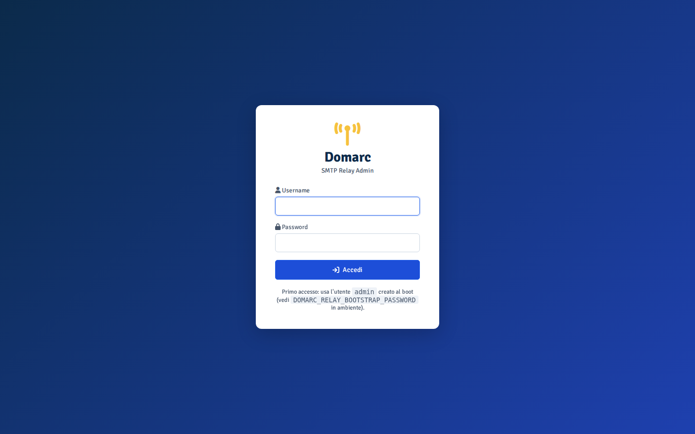

### Ruoli disponibili

| Ruolo | Cosa può fare |
|---|---|
| **viewer** | Vedere tutto (sola lettura). Utile per analisti che osservano senza toccare. |
| **operator** | Vedere + gestire regole, clienti, orari, decisioni IA. Non gestisce utenti né configurazioni di sistema. |
| **admin** | Tutto quanto, compresi utenti, provider IA, secret. |
| **superadmin** | Multi-tenant: può vedere e amministrare tutti i tenant della piattaforma. |

> **Nota:** alcune voci di menu sono visibili solo a chi ha il ruolo giusto. Se non vedi una funzione descritta in questo manuale, probabilmente il tuo ruolo non la include.

---

## 3. Dashboard

La home dopo il login mostra un riassunto immediato dello stato del sistema.

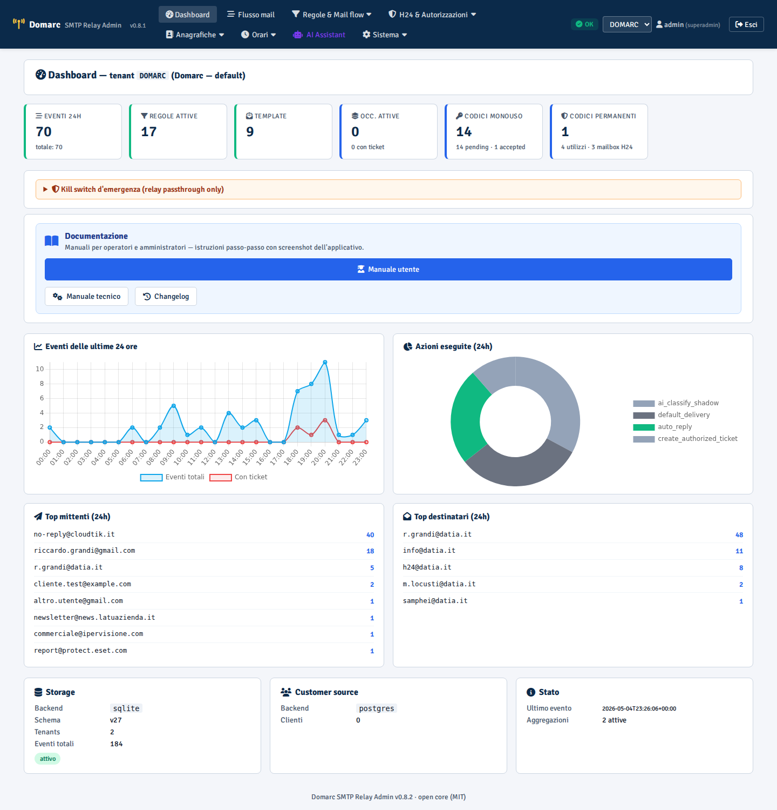

Qui trovi:

- **Conteggio mail processate** nelle ultime 24 ore.
- **Distribuzione delle azioni**: quante sono state inoltrate, quante ignorate, quante hanno aperto un ticket, ecc.
- **Stato dei servizi** collegati (listener SMTP, provider IA, sync clienti).
- **Ultimi eventi recenti** in coda.

Usala come "termometro" all'inizio della giornata.

---

## 4. Le regole — il cuore del sistema

È **la parte più importante** del sistema. Una regola dice: *"se arriva una mail con queste caratteristiche, fai questa azione."*

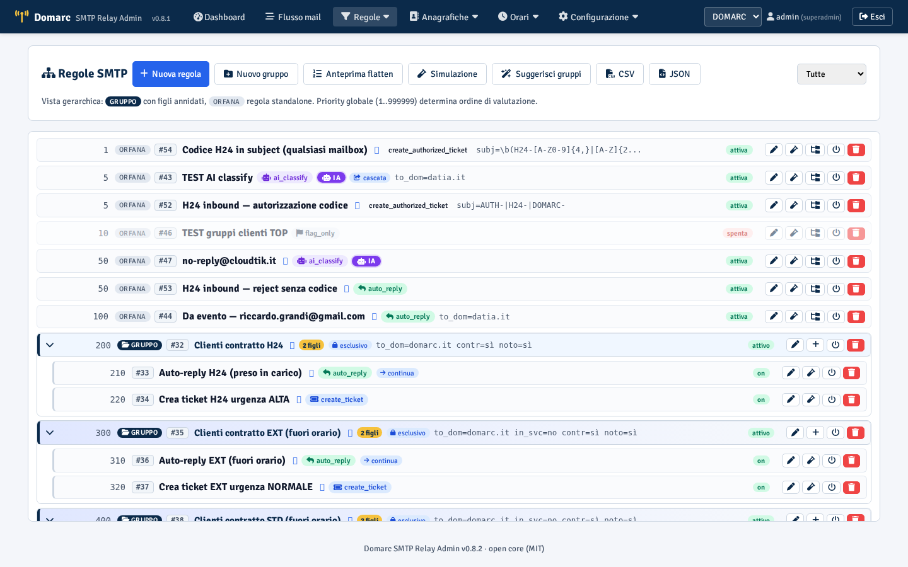

### Anatomia di una regola

| Campo | Esempio | A cosa serve |
|---|---|---|
| **Nome** | "Backup falliti server X" | Etichetta umana, non condiziona il match. |
| **Priorità** | 100 | Più bassa = valutata prima. Le regole sono percorse in ordine di priorità crescente. |
| **Match — From** | `noc@vendor.com` | La regola scatta se il mittente coincide. |
| **Match — Oggetto (regex)** | `(?i)backup.*failed` | Espressione regolare sull'oggetto. Insensibile alle maiuscole con `(?i)`. |
| **Match — Dominio destinatario** | `domarc.it` | Filtra le mail dirette a domini specifici. |
| **Azione** | `forward`, `ignore`, `quarantine`, `ai_classify`, `create_ticket` | Cosa fare quando la regola scatta. |

### Le azioni principali

- **ignore** — la mail viene scartata silenziosamente. Tipico per newsletter, conferme automatiche di scarso valore.
- **forward** — inoltro a uno o più destinatari (es. il tecnico di turno). È l'azione "passa avanti".
- **quarantine** — la mail viene messa da parte; serve un'azione manuale dell'operatore per liberarla o eliminarla. Utile per spam sospetto.
- **ai_classify** — la mail viene passata all'IA, che decide tipologia + urgenza + sintesi e propone un'azione. Vedi [§ 8](#8-intelligenza-artificiale-ia).
- **create_ticket** — apre direttamente un ticket nel gestionale.

### Gerarchia padre/figlio (Rule Engine v2)

Una regola può essere un **gruppo** che contiene **regole figlie**. Esempio: gruppo "Errori backup" → regole figlie per ogni vendor (Veeam, Acronis, Synology…). Il gruppo concentra il match generale; i figli affinano.

Quando un gruppo è marcato **esclusivo**, solo una delle sue figlie può scattare. Quando non è esclusivo, tutte le figlie compatibili possono eseguirsi in cascata.

### Validazione automatica

Quando salvi una regola, il sistema esegue 14 controlli (V001-V008 + warning W001-W005) per evitare configurazioni illogiche:

- Un gruppo non può avere padre.
- Un gruppo deve avere almeno un criterio di match.
- Le priorità dei figli devono essere strettamente fra il padre e la regola top-level successiva.
- Riferimenti circolari bloccati.

Se una regola non passa la validazione il sistema spiega in italiano cosa è sbagliato e dove correggere.

### Buone abitudini

1. **Inizia largo, poi affina**: scrivi prima la regola generica, valuta in produzione, poi crea le figlie quando vedi i casi.
2. **Usa la priorità come filtro a imbuto**: priorità basse = regole molto specifiche (es. mittente esatto); priorità alte = catch-all.
3. **Non lasciare mai una regola senza match_*** : verrebbe applicata a tutto.
4. **Testa le regex** prima di salvare: la console ha un test inline.

---

## 5. Anagrafica clienti e orari di servizio

### Anagrafica clienti

L'elenco dei clienti viene preso dal gestionale. Per ognuno vedi codice, ragione sociale, profilo orari, stato contratto, domini gestiti, eventuali eccezioni del giorno, e azioni rapide.

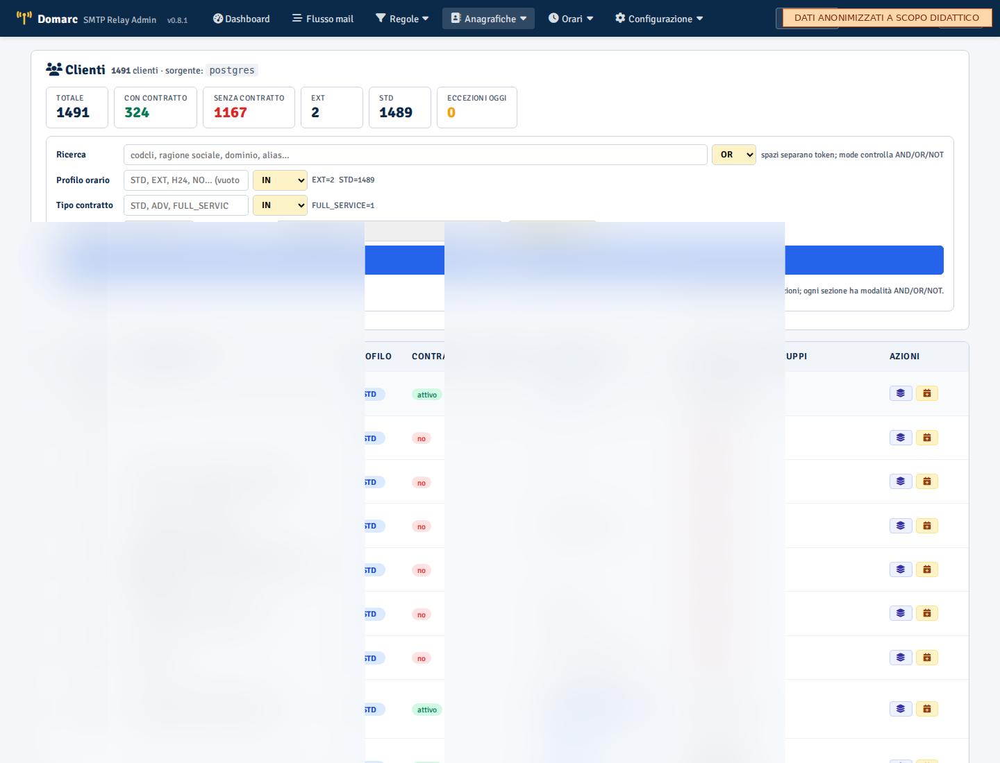

In alto trovi:

- **Card statistiche**: totale clienti, con/senza contratto, distribuzione per profilo orario (STD / EXT / H24 / NO).
- **Filtri pill**: clicca su "STD" per vedere solo i clienti con profilo Standard, su "Active" per i contratti attivi, ecc.
- **Ricerca globale** in alto per cercare per codice, nome, dominio o alias.

### Orari di servizio (Profili)

Ogni cliente ha un **profilo orari canonico** che dice quando il servizio di assistenza è "in orario":

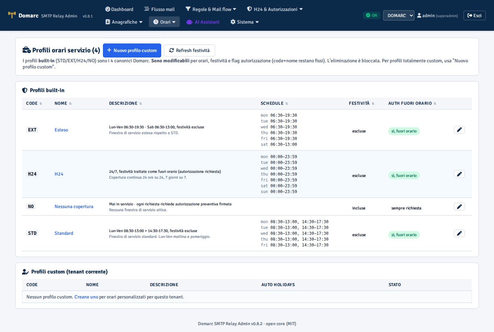

| Profilo | Orari |
|---|---|
| **STD** (Standard) | Lun-Ven 9:00-13:00 / 14:00-18:00 |
| **EXT** (Esteso) | Lun-Ven 8:00-20:00, Sab 9:00-13:00 |
| **H24** | Tutti i giorni 24/7 |
| **NO** | Nessun servizio |

### Eccezioni per cliente

A volte un cliente ha bisogno di una regola diversa **solo per un giorno** (es. festività, evento aziendale). Dalla pagina cliente, il pulsante eccezioni apre il form per creare un'eccezione puntuale.

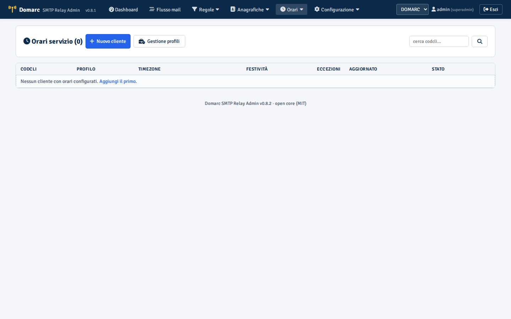

Le eccezioni hanno data inizio/fine e tipo:
- **closed** — quel giorno il servizio è chiuso anche se il profilo direbbe il contrario.
- **open** — il servizio è aperto in via straordinaria.
- **custom** — fascia oraria custom solo per quel giorno.

> **Suggerimento:** se vedi nella tabella clienti un'icona rossa "⚠ N eccezione/i oggi" significa che oggi quel cliente ha un'eccezione attiva. Cliccala per vederne il dettaglio.

---

## 6. Cronologia eventi e Activity live

### Cronologia eventi

Tutto quello che il sistema fa con le mail viene tracciato. La pagina **Eventi** è il registro storico: ogni mail ricevuta, cosa ha fatto match, che azione ha eseguito.

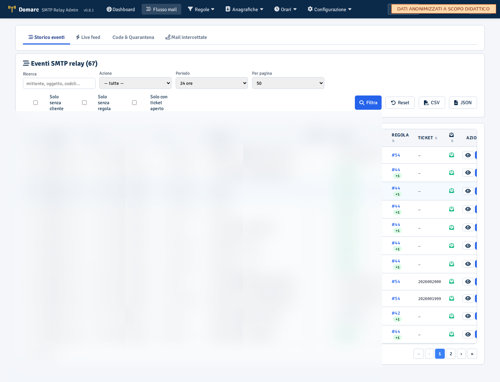

Filtri principali:

- **Range temporale** (24h / 7g / 30g o custom).
- **Azione eseguita** (ignore / forward / ai_classify / quarantine / …).
- **Mittente o destinatario** (full-text).
- **ID regola** (per vedere solo gli eventi di una specifica regola).

Cliccando su un evento ottieni il dettaglio: mittente, destinatari, oggetto, regola applicata, eventuali metadati IA (classificazione, urgenza, sintesi).

### Activity live

Per chi vuole vedere il **flusso in tempo reale** mentre lavora, la pagina Activity live mostra in 3 colonne sincronizzate quello che sta accadendo proprio ora:

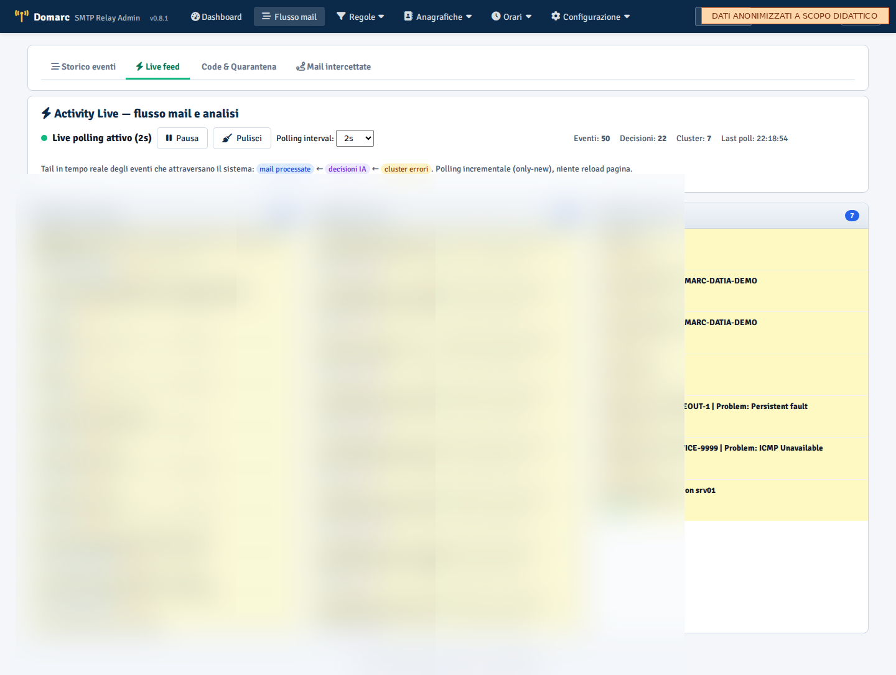

- **Colonna 1 — Mail processate**: ogni mail nuova compare in cima con un flash giallo, indicando subject, from, to, regola, azione.
- **Colonna 2 — Decisioni IA**: ogni inferenza dell'IA (classificazione, urgenza, sintesi, costo, latenza).
- **Colonna 3 — Cluster errori**: aggiornamenti dei cluster di errori semanticamente simili (vedi [§ 8.4](#84-cluster-errori)).

Controlli:

- **Pulsante Pausa/Riprendi** per congelare la vista.
- **Selettore intervallo polling** (1/2/5/10 secondi).
- **Pulisci** per resettare le colonne.
- **Indicatore di pulsazione** (in alto): pulsa quando il polling è attivo.

> **Nota:** la pagina mostra **solo i nuovi eventi** dall'ultimo polling. Non ricarica tutta la cronologia ogni volta — è leggera anche con tanto traffico.

---

## 7. Coda e quarantena

Le mail che il sistema accetta non vanno consegnate immediatamente: passano dalle code interne. Da qui puoi controllarle.

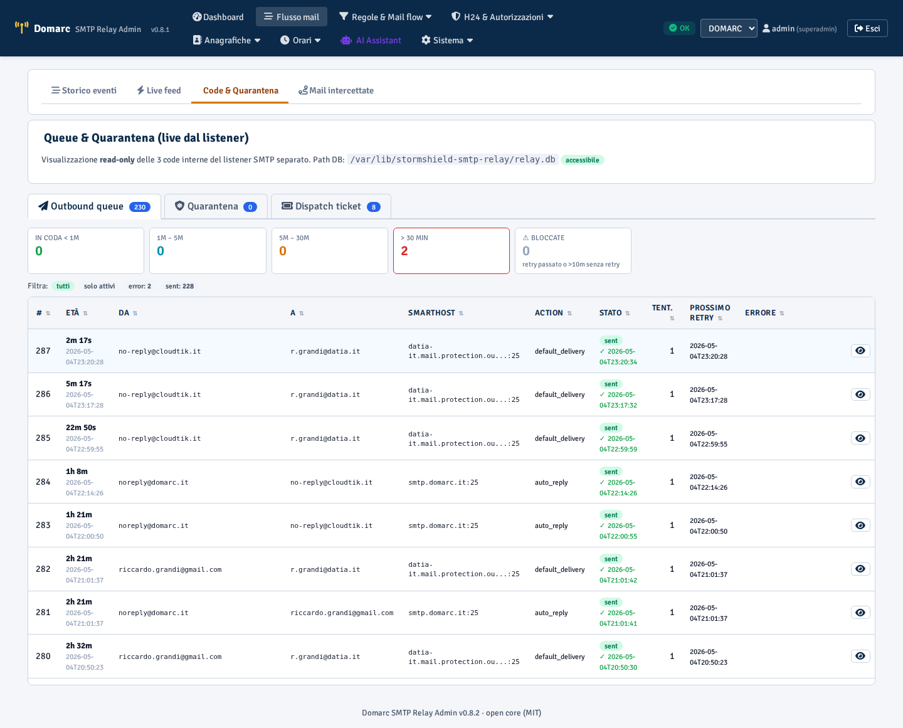

La pagina ha **3 tab**:

### Outbound queue
Le mail accettate dal listener e in attesa di essere consegnate al server di destinazione (smarthost). Per ognuna vedi: stato (`sent`, `pending`, `failed`, `delivered`), tentativi, prossimo retry, ultimo errore, dimensione MIME.

I colori:
- 🟢 **sent / delivered** — consegnata correttamente.
- 🟡 **pending** — in attesa, sarà tentata a breve.
- 🔴 **failed** — tutti i tentativi sono falliti, mail persa o messa da parte.

### Quarantena
Le mail messe da parte da una regola `quarantine` o filtrate per motivi di sicurezza. Sono **read-only dalla console**: il rilascio o l'eliminazione vanno effettuate via CLI sul server del listener (decisione architetturale: meno superficie di attacco lato web).

### Dispatch
I ticket in attesa di essere creati nel gestionale (per casi in cui il gestionale è temporaneamente irraggiungibile).

---

## 8. Intelligenza Artificiale (IA)

L'IA aggiunge un **layer semantico** sopra il rule engine: dove le regole rigide non bastano, l'IA legge la mail, capisce di cosa parla e propone un'azione.

> **Privacy:** prima di mandare la mail all'IA, il sistema **rimuove i dati personali** (firme, nomi, IBAN, codici fiscali, partite IVA, telefoni). L'IA non vede mai queste informazioni in chiaro.

### 8.1 Dashboard IA

Il termometro generale dell'attività IA: quante decisioni, quanto stanno costando, latenze, distribuzione per tipo di lavoro (job).

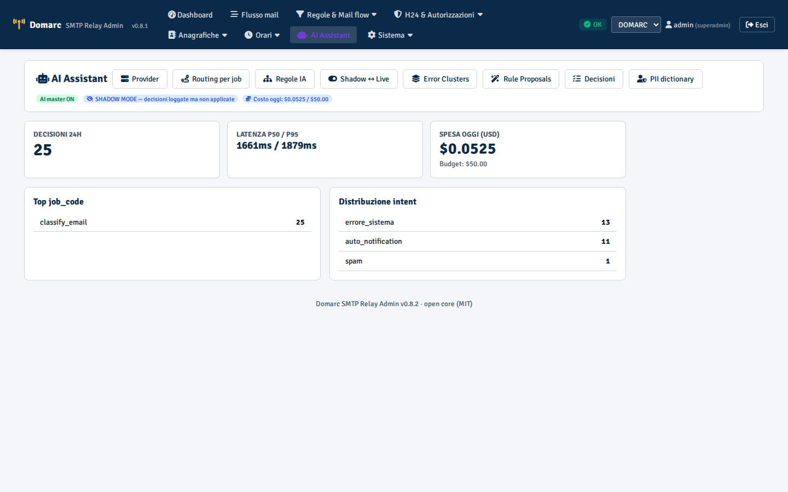

### 8.2 Decisioni IA

Lo storico di **ogni inferenza** che l'IA ha fatto. Per ogni decisione vedi: classificazione (es. "richiesta_assistenza", "spam", "newsletter"), urgenza (BASSA/MEDIA/ALTA), sintesi in 1-2 righe, modello usato (Haiku / Sonnet), latenza, costo in dollari, e se è stata applicata o solo loggata in modalità ombra.

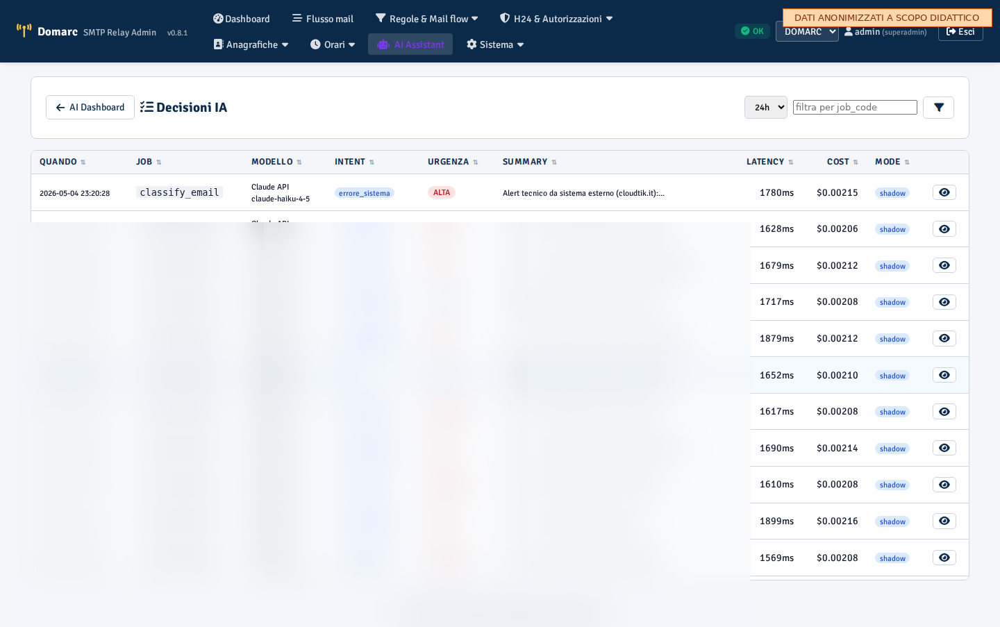

#### Modalità ombra (shadow)

All'inizio l'IA gira in **shadow mode**: registra cosa avrebbe fatto, ma non agisce. Serve a tunare i prompt e a confrontare la sua decisione con quella del rule engine. Quando sei soddisfatto di come decide, il superadmin può togliere lo shadow mode e l'IA inizia ad agire davvero.

### 8.3 Routing modelli per job

Ogni "lavoro" che l'IA fa (classificare, riassumere, valutare urgenza, ecc.) può essere bindato a un **modello specifico**. Per default:

- Lavori frequenti e poco critici → `claude-haiku-4-5` (veloce, economico).
- Lavori delicati (`critical_classify`) → `claude-sonnet-4-6` (più ragionato, costo maggiore).

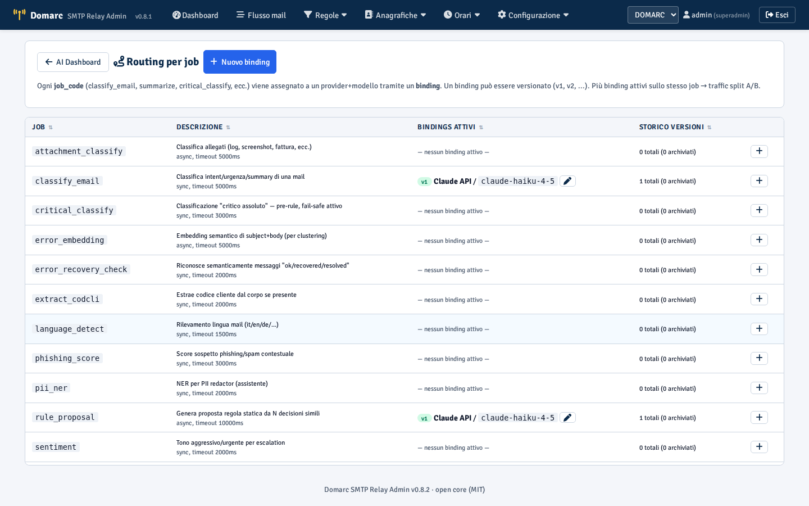

Da qui puoi:
- Cambiare modello per un job.
- Modificare il prompt usato.
- Fare A/B testing (es. 80% Haiku, 20% Sonnet) e vedere quale risponde meglio.
- Versionare i binding e tornare indietro se una nuova versione peggiora.

### 8.4 Cluster errori

Storicamente, mail di errore ripetitive ("backup failed on srv01", "backup failed on srv02"…) generavano N ticket separati. Ora l'IA le **raggruppa per significato** in cluster semantici.

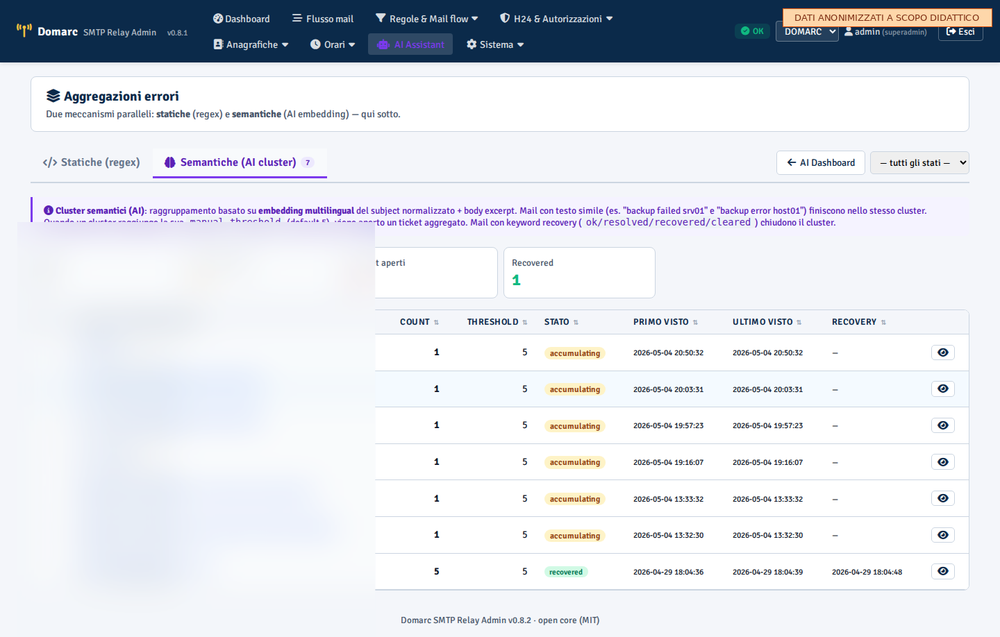

Ogni cluster ha:
- Un soggetto rappresentativo (la mail più "tipica" del gruppo).
- Conteggio totale di mail simili.
- Soglia (default 5): solo quando arrivi a 5 mail simili scatta il ticket aggregato.
- Finestra di recovery (default 60 min): se entro 60' arriva un messaggio "ok / recovered", il cluster si chiude da solo.

Puoi modificare soglia e finestra per cluster, da UI.

### 8.5 Proposte di regole (Rule Proposer)

L'IA osserva le sue stesse decisioni: se vede 20+ mail simili tutte classificate uguale, **propone una regola statica** che faccia il lavoro senza più chiamare l'IA.

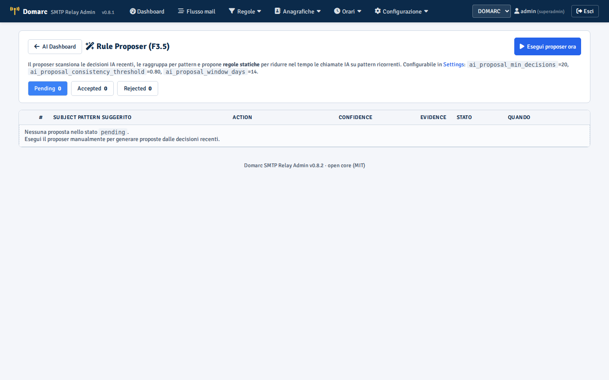

Per ogni proposta vedi:
- Pattern proposto (es. regex sull'oggetto + dominio mittente).
- Azione consigliata.
- Confidenza (0.0-1.0).
- Esempi reali (mail su cui si è basata).

Tu **accetti o rifiuti**. Se accetti, la proposta diventa una regola in `Regole` e da quel momento il rule engine fa il lavoro a costo zero.

> Questo loop riduce nel tempo le chiamate IA (e il costo) facendo "imparare" il sistema dagli esempi.

### 8.6 Provider IA

Configurazione dei provider (per ora Claude API; in roadmap anche server NVIDIA self-hosted). Per ognuno: stato, endpoint, modello default, test di connettività inline.

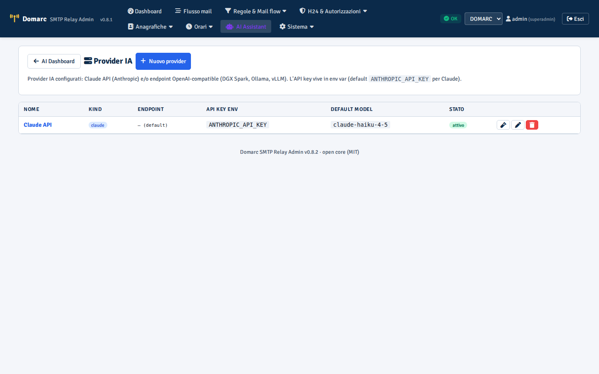

---

## 9. Template di risposta

Quando un'azione richiede di rispondere al mittente (es. accettazione automatica di una richiesta), il sistema usa un **template** di reply.

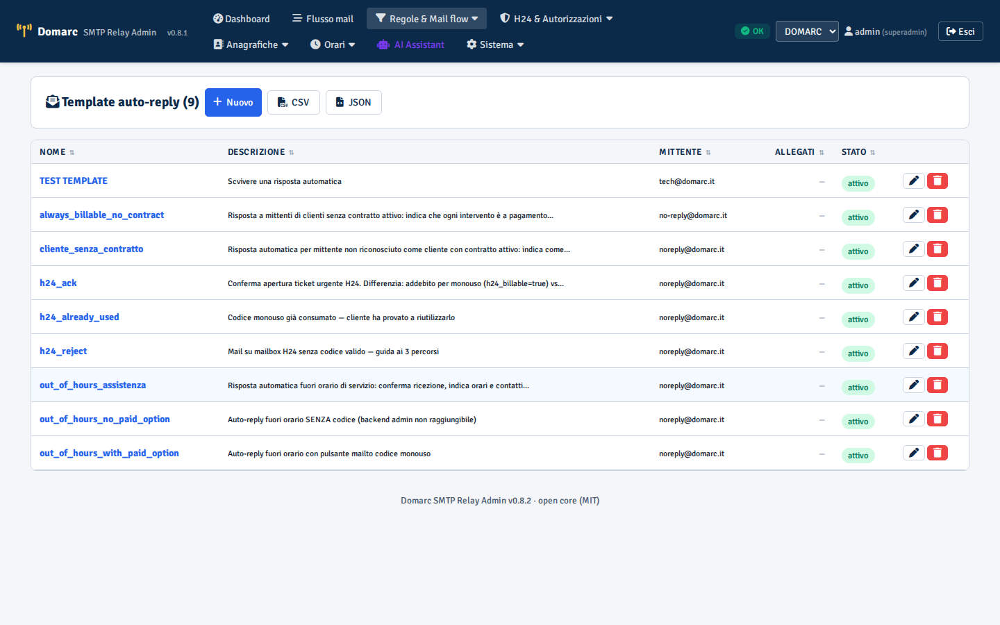

Ogni template ha:
- **Codice** identificativo (es. `auto_reply_received`).
- **Oggetto** (può contenere segnaposti).
- **Corpo** (testo o HTML, con segnaposti tipo `{{from_name}}`, `{{ticket_id}}`).
- **Allegati** opzionali.

I segnaposti vengono sostituiti automaticamente al momento della risposta.

---

## 10. Utenti, ruoli e sicurezza

### Gestione utenti

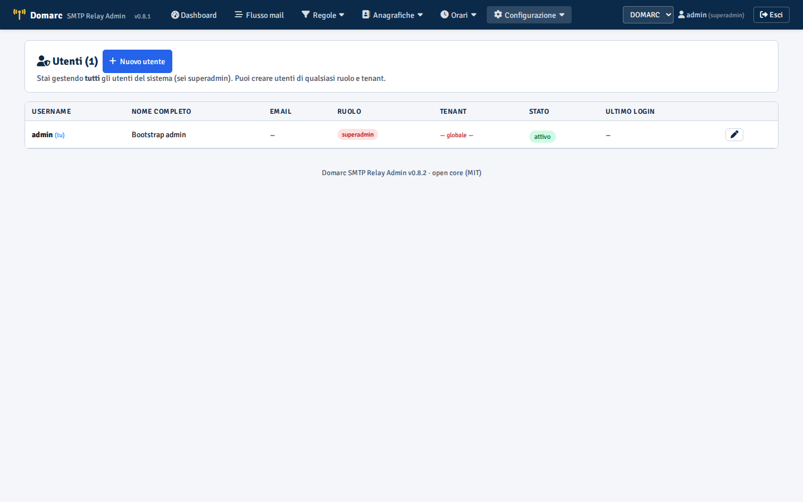

Da qui crei nuovi utenti, assegni ruoli, attivi/disattivi account, resetti password.

### Buone pratiche

1. **Un utente per persona**: niente account condivisi.
2. **Ruolo minimo necessario**: dai `viewer` se basta vedere, `operator` se deve modificare regole, `admin` solo a chi gestisce il sistema.
3. **Password robuste**: minimo 12 caratteri, mix maiuscole/minuscole/numeri/simboli.
4. **Disabilita** invece di cancellare: l'utente disabilitato non può più loggarsi ma la storia delle sue azioni resta tracciata.

---

## 11. Domande frequenti

### Una mail non è arrivata al destinatario, dove la cerco?

In ordine:
1. **Eventi** → cerca per mittente o oggetto: vedi se è stata processata e che azione ha avuto.
2. **Coda** → tab Outbound: se è in `pending` o `failed` è ancora qui.
3. **Coda** → tab Quarantena: se una regola l'ha messa in quarantena.
4. Se l'azione è stata `forward` ma il destinatario non l'ha vista, è un problema **lato gateway destinatario** (es. M365 antispam): controlla la quarantena del provider mail finale.

### Come faccio a sapere quale regola ha gestito una mail?

Dalla pagina **Eventi**, in ogni riga c'è il campo `rule_id` con link diretto alla regola che ha fatto match.

### L'IA mi sta classificando male un certo tipo di mail. Cosa posso fare?

Tre strade, in ordine di preferenza:
1. **Crea una regola statica** che gestisca quel pattern senza IA — più affidabile e gratis.
2. **Modifica il prompt** del job IA in `IA → Routing modelli` aggiungendo esempi del caso.
3. **Cambia modello** (es. da Haiku a Sonnet per maggior precisione).

### Posso testare una regola prima di metterla live?

Sì: nel form regola c'è un **test inline** della regex e un'anteprima dell'azione. In più, se vuoi testare a sistema, puoi creare la regola con priorità alta (catch-all dopo) e azione `ignore` per vedere quanti eventi farebbe match senza effetti collaterali.

### Quanto costa l'IA?

Si paga per token (input + output) Anthropic. La dashboard IA mostra il **costo cumulativo giornaliero**. Esiste un **limite giornaliero** (`ai_daily_budget_usd`, default 50$) oltre cui l'IA si sospende automaticamente e parte il fail-safe.

### Cosa succede se l'IA è offline?

**Fail-safe automatico**: la mail viene inoltrata a un indirizzo di sicurezza (configurabile) e viene aperto un ticket urgenza ALTA con flag `ai_unavailable=true`. Nessuna mail viene persa.

### Come capisco se il listener SMTP funziona?

Dashboard mostra lo stato. In più:
- **Coda → Outbound** con eventi recenti = listener riceve e accoda.
- **Activity live** colonna mail = listener processa attivamente.
- Se non vedi nulla per molto tempo, c'è un problema. Contatta il sistemista.

---

## Appendice — Riferimenti tecnici

Per chi vuole scendere nei dettagli (schema DB, endpoint API, flusso di sync, configurazioni avanzate):

- **Manuale tecnico auto-generato**: voce di menu **Manuale**, oppure file [`docs/manual.md`](../manual.md).
- **Architettura Rule Engine v2**: [`docs/rule_engine_v2.md`](../rule_engine_v2.md).
- **AI Assistant — design e prompt**: [`docs/ai_assistant.md`](../ai_assistant.md).
- **Operations / runbook**: [`docs/operations.md`](../operations.md).


---

*Manuale utente Domarc SMTP Relay — © 2026 Domarc S.r.l.*
